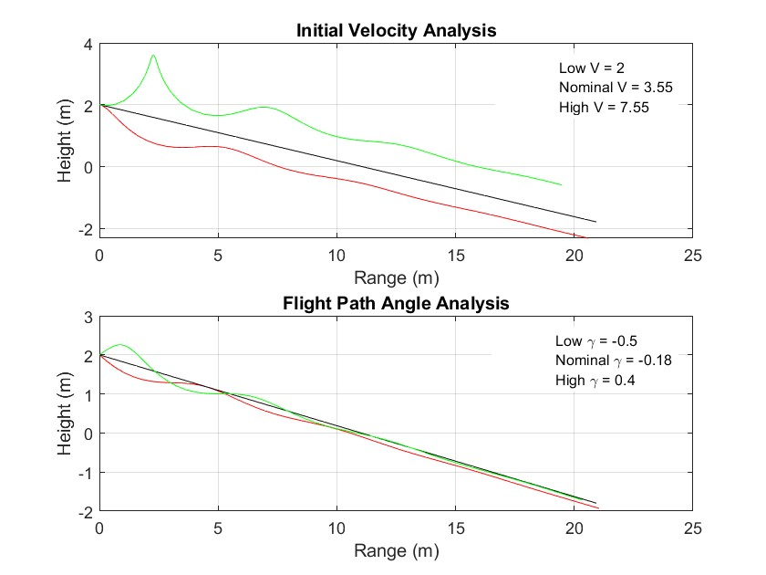
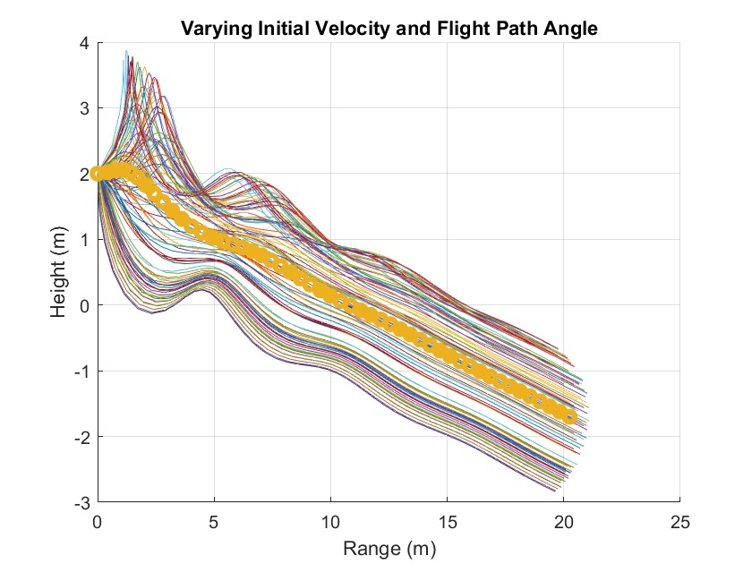
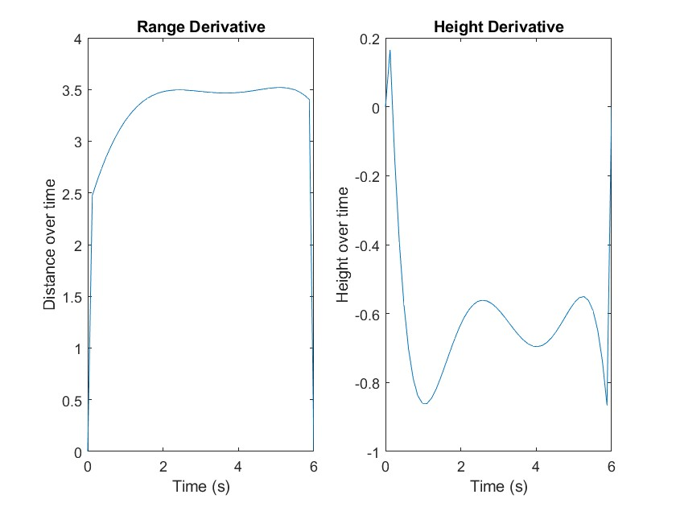

# AEM3103_Final
  # Paper Airplane Numerical Study
  Final Project: AEM 3103 Spring 2024

  - By: Colton Davies

  ## Summary of Findings

	- This project provides a comprehensive insight into the effect of initial flight conditions on the paper airplanes trajectory. Altering any of these initial values dramatically changes the resulting flight.

 
  # Code Listing
  A list of each function/script and a single-line description of what it does.  The name of the function/script should link to the file in the repository on GitHub.

	-[PaperPlane](https://github.com/ColtonD88/AEM3103_FinalProject/blob/main/PaperPlane.m)
		- This script contains the entirety of graphing and analysis of the paper plane flight. Range and distance both evaluated while varying initial velocity as well as initial flight path angle. 
	-[EqMotion](https://github.com/ColtonD88/AEM3103_FinalProject/blob/main/EqMotion.m)
        - This function utilizes all initial parameters and calculates the following range and distance associated with each given timestep, it is referenced in PaperPlane script for each trajectory calculation.

  # Figures

  ## Fig. 1: Single Parameter Variation

    - This figure shows the high, nominal, and low trajectory values related to the max, min, and nominal initial velocity as well as the initial flight path angle associated with each.

  ## Fig. 2: Monte Carlo Simulation

    - This figure presents the monte carlo simulation of the airplane trajectories. The initial velocity and the flight path angle were varied randomly between a max and min value to provide 100 distinct flight paths.

 ## Fig. 3: Time Derivatives

    - This figure establishes an estimated time derivative of the height and range respectively utilizing the central method of derivative calculation.